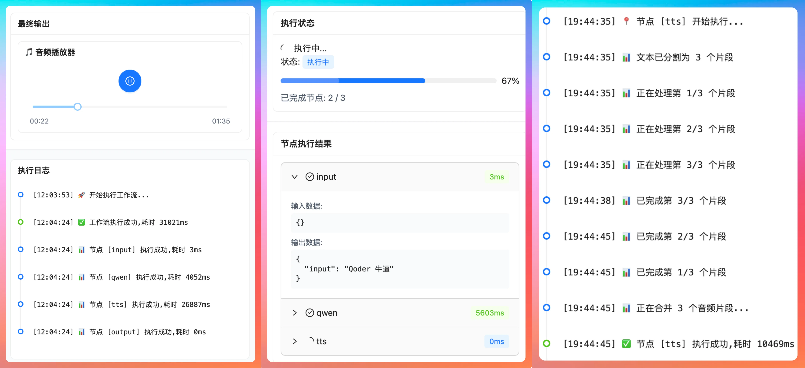

<div align="center">

# FlowMindAgent

**AI 工作流可视化编排平台**

通过拖拽式界面编排和执行 AI 工作流，实现多模型与工具节点的协同调度。

[](https://www.oracle.com/java/)
[](https://spring.io/projects/spring-boot)
[](https://spring.io/projects/spring-ai)
[](https://reactjs.org/)
[](https://www.typescriptlang.org/)
[](https://github.com/bsorrentino/langgraph4j)

[快速开始](#快速开始) • [核心特性](#核心特性) • [技术架构](#技术架构)

</div>

---

## 项目简介

FlowMindAgent 是一个 AI 工作流可视化编排平台。通过拖拽式界面构建 AI 处理流程，支持多种大模型（DeepSeek、通义千问等）和工具节点的编排组合。项目基于双引擎架构——自研 DAG 引擎处理线性工作流，LangGraph4j 状态图引擎处理带条件分支的复杂流程。



## 核心特性

### 可视化流程编辑器

基于 ReactFlow 构建的流程图编辑器，支持节点拖拽、连线配置、参数编辑等完整操作。

### 多模型节点支持

通过 Spring AI 框架统一接入：

- **OpenAI 节点**：GPT 系列
- **DeepSeek 节点**：国产大模型
- **通义千问节点**：通义千问系列（DashScope 原生支持）
- **智谱 AI 节点**：GLM 系列
- **AIPing 节点**：第三方模型代理

### 工具节点

- TTS 音频合成（通义 Qwen3 TTS + 阶跃星辰 StepAudio）
- 输入/输出节点
- 自定义扩展节点

### DAG 工作流引擎

- 基于 Kahn 算法的拓扑排序调度
- DFS 循环检测
- 节点间数据传递机制

### LangGraph4j 状态图引擎

- 基于 StateGraph 的条件分支与动态路由
- EngineSelector 双引擎按需切换
- NodeAdapter 适配器复用已有节点执行器

### Skills 技能系统

- SKILL.md + YAML Frontmatter 声明式技能定义
- 三级渐进式加载（摘要 → 详情 → 引用文档）
- Spring AI FunctionCallback 集成，LLM 可自主调用技能


## 技术架构

```
前端层: React 18 + TypeScript + ReactFlow + Ant Design
后端层: Spring Boot 3.4.1 + Java 21 + MyBatis-Plus
引擎层: DAG 引擎 / LangGraph4j 状态图引擎 (EngineSelector 路由)
AI 层  : Spring AI / Spring AI Alibaba (ChatClientFactory)
数据层: MySQL + MinIO (可选)
```

### 技术栈

| 层级 | 技术 | 版本 |
|------|------|------|
| 前端 | React + TypeScript + Vite | 18.x / 5.x |
| 前端 | ReactFlow + Ant Design + Tailwind CSS | -- |
| 前端 | Zustand | -- |
| 后端 | Spring Boot | 3.4.1 |
| 后端 | Java | 21+ |
| 后端 | MyBatis-Plus | 3.5.5 |
| 后端 | Spring AI | 1.0.0-M5 |
| 后端 | Spring AI Alibaba | 1.0.0-M6.1 |
| 引擎 | 自研 DAG 引擎 | -- |
| 引擎 | LangGraph4j | 1.8.0-beta3 |
| 存储 | MySQL | 8.0+ |
| 存储 | MinIO | 可选 |

## 快速开始

### 环境要求

- Java 21+
- Node.js 18+
- MySQL 8.0+
- Maven 3.8+

### 启动步骤

1. **克隆项目**

   ```bash
   git clone https://github.com/erencrz/FlowMindAgent.git
   cd FlowMindAgent
   ```

2. **创建数据库**

   ```sql
   CREATE DATABASE flowmindagent DEFAULT CHARACTER SET utf8mb4 COLLATE utf8mb4_unicode_ci;
   ```

3. **配置环境变量**

   ```bash
   cd backend
   cp .env.example .env
   ```

   编辑 `backend/.env`，配置数据库密码等信息。

4. **导入数据库**

   ```bash
   mysql -u root -p flowmindagent < backend/src/main/resources/schema.sql
   ```

5. **启动后端**

   ```bash
   cd backend && ./mvnw spring-boot:run
   ```

6. **启动前端**

   ```bash
   cd frontend
   npm install
   npm run dev
   ```

7. **登录**

   默认账号：admin / admin123

## 项目结构

```
backend/                      # Spring Boot 后端
  src/main/java/com/paiagent/
    engine/                   # 工作流引擎
      dag/                    # DAG 引擎 (Kahn 拓扑排序 + DFS 循环检测)
      langgraph/              # LangGraph4j 状态图引擎
      skill/                  # Skills 技能系统
      llm/                    # LLM 调用层 (ChatClientFactory)
      executor/               # 节点执行器
      model/                  # 数据模型
    controller/               # REST API
    service/                  # 业务逻辑
    mapper/                   # 数据访问层
    entity/                   # 数据库实体
    config/                   # 配置类
    interceptor/              # 认证拦截器

frontend/                     # React 前端
  src/
    components/               # FlowCanvas, NodePanel, DebugDrawer 等
    pages/                    # LoginPage, MainPage, EditorPage
    store/                    # Zustand 状态管理
    api/                      # API 调用

docs/                         # 项目文档
image/                        # 截图
```

## 关键设计

### 双引擎架构

EngineSelector 按工作流的 engineType 配置自动选择执行引擎：

- `dag` — 自研 DAG 引擎，基于 Kahn 算法拓扑排序，DFS 检测循环依赖
- `langgraph` — LangGraph4j 状态图引擎，支持条件分支和动态路由，通过 NodeAdapter 桥接复用节点执行器

两种引擎基于工作流粒度切换，默认使用 DAG 引擎保证向后兼容。

### LLM 调用层

基于 Spring AI 框架，通过 ChatClientFactory 动态工厂在运行时根据节点配置（apiKey / apiUrl / model）实例化对应厂商的 ChatClient。五种 LLM 节点共用 AbstractLLMNodeExecutor 抽象基类，节点执行器核心代码精简到 75 行。

```java
ChatClient chatClient = chatClientFactory.createClient(nodeType, apiUrl, apiKey, model, temperature);
String response = chatClient.prompt().user(prompt).call().content();
```

PromptTemplateService 统一处理 `{{variable}}` 模板变量替换和上下游节点参数引用，支持静态值和动态引用两种参数类型。

### Skills 技能系统

技能以目录形式组织，每个技能包含 SKILL.md 主文件和可选的 reference 引用文档：

```
skills/ai-podcast/
  SKILL.md               # YAML Frontmatter + Markdown
  reference/
    script-template.md
    voice-guide.md
```

三级加载机制：
1. 摘要（名称+描述）—— 用于列表展示
2. 详情（完整 SKILL.md）—— 执行时按需加载
3. 引用文档（reference/）—— LLM 需要时加载，节省 Token 开销

### 节点扩展

实现 NodeExecutor 接口后注册到 NodeExecutorFactory 即可添加新节点。LLM 节点推荐继承 AbstractLLMNodeExecutor，自动获得 Spring AI 流式输出和统一调用能力。

```java
public class CustomNodeExecutor implements NodeExecutor {
    @Override
    public Map<String, Object> execute(WorkflowNode node, Map<String, Object> input) {
        // 自定义逻辑
        return output;
    }
}
```

## 示例工作流

```
[输入节点] → [DeepSeek节点] → [TTS节点] → [输出节点]
```

---

<div align="center">

[回到顶部](#flowmindagent)

</div>
